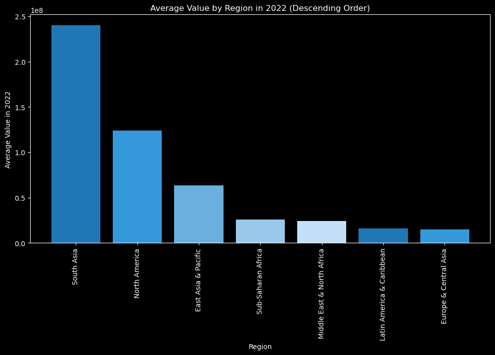

## Analyzing Global Population Trends and Their Socioeconomic Implications  

## BUSINESS UNDERSTANDING  
 
The objective of this data science project is to:
* analyze global population trends and understand their potential socioeconomic implications using a comprehensive dataset    
* provide insights into how population growth and distribution have evolved over time and how they correlate with different socioeconomic factors.     

## DATA UNDERSTANDING      
The datasets is obtained from The World Bank website [Population](https://data.worldbank.org/indicator/SP.POP.TOTL)
The dataset contains information about the population of various countries over several decades, along with additional details such as region and income group.   
Columns of the population dataset include: 
* ``` Country Name ``` : The name of the country or region.   
* ``` Country Code ```: A unique code or identifier for each country or region.       
* ```Indicator Name```: The name of the indicator or measurement, which in this case is "Population, total."     
* ``` Indicator Code```: A code that identifies the specific  indicator, which is "SP.POP.TOTL" for total population.     
 
The columns from the metadata: 
  
* ```IncomeGroup```: The income group to which the country belongs, such as "High income" or "Low income." Similar to the 'Region' column, not all countries have this information (indicated by NaN).

* ```SpecialNotes```: Additional notes or information related to the country. This column contains text descriptions that may provide context or explanations for specific countries or regions.

* ```TableName```: The name of the country or region.  

# ANALYSIS

##### Average Population by Region in 2022



*inference*     
* from above in 2022 South Asia has the highest population among the other regions
* High-Population Regions: The top 3 regions  represent areas with the highest average populations in 2022. These regions may include densely populated countries and urban centers.
* Low-Population Regions: These regions may include sparsely populated areas and smaller countries.
* Socioeconomic Implications: High-population regionslike South Asia  may face challenges related to resource management, infrastructure development, healthcare, and education. Policymakers may need to address these challenges to ensure the well-being of their populations


#### AUTHOR           
marwa Osman: marwaosman9975@gmail.com    

👉 [LinkedIn](https://www.linkedin.com/in/marwa-osman-00190b222/)

👉 [GitHub](https://github.com/marwa9975)

